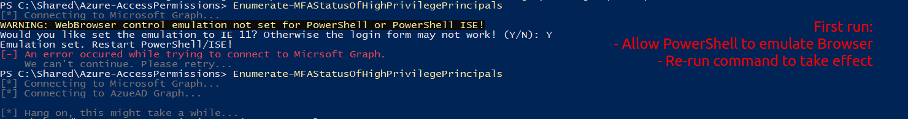
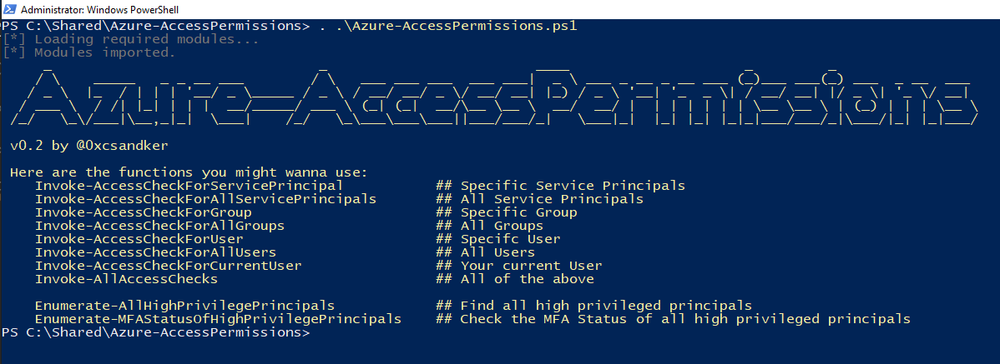
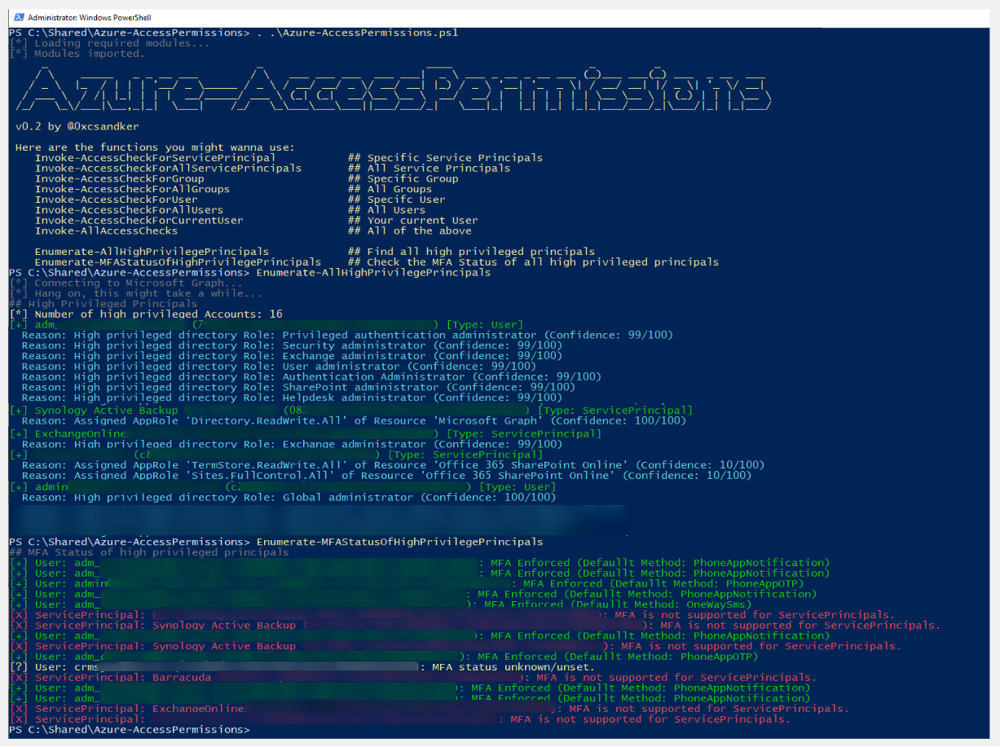

# Azure-AccessPermissions

Easy to use PowerShell script to enumerate access permissions in an Azure Active Directory environment.

Background details can be found in the accompanied blog posts:

- [Untangling Azure Active Directory Principals & Access Permissions](https://csandker.io/2022/10/19/Untangling-Azure-Permissions.html)
- [Untangling Azure Active Directory Permissions II: Privileged Access](https://csandker.io/2022/11/10/Untangling-Azure-II-Privileged-Access.html)

## Requirements

To run this script you'll need these two PowerShell modules:
- [Microsoft.Graph](https://github.com/microsoftgraph/msgraph-sdk-powershell)
- [AADInternals](https://github.com/Gerenios/AADInternals)
- [AzureADPreview]https://learn.microsoft.com/en-us/powershell/azure/active-directory/install-adv2?view=azureadps-2.0)

All of these can be installed directly within PowerShell:

```PowerShell
PS:> Install-Module Microsoft.Graph
PS:> Install-Module AADInternals
PS:> Install-Module AzureADPreview
```

## Usage

### First time use

The script uses a browser-based Login UI to connect to Azure. If you run the tool for the first time you might experience the following error

```s
[*] Connecting to Microsoft Graph...
WARNING: WebBrowser control emulation not set for PowerShell or PowerShell ISE!
Would you like set the emulation to IE 11? Otherwise the login form may not work! (Y/N): Y
Emulation set. Restart PowerShell/ISE!
```



To solve this simply allow PowerShell to emulate the browser and rerun your command.

### Example use

Import and run, no argumentes needed. 

*Note: On your first run you will likely have to authenticate twice (once Microsoft Graph and once against Azure AD Graph). I might wrap this into a single login in the future...*

```PowerShell
PS:> Import-Module .\Azure-AccessPermissions.ps1
```



