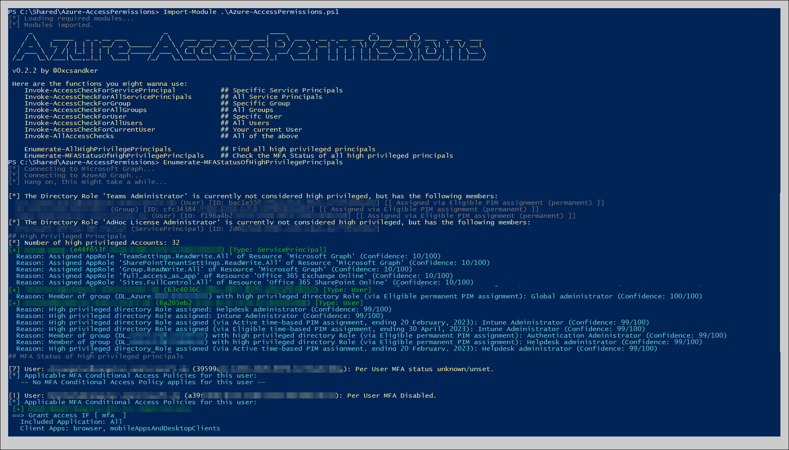

# Azure-AccessPermissions

Easy to use PowerShell script to enumerate access permissions in an Azure Active Directory environment.

Background details can be found in the accompanied blog post:

[Untangling Azure Active Directory Principals & Access Permissions](https://csandker.io)

## Requirements

To run this script you'll need these two PowerShell modules:
- [Microsoft.Graph](https://github.com/microsoftgraph/msgraph-sdk-powershell)
- [AADInternals](https://github.com/Gerenios/AADInternals)

Both of these can be installed directly within PowerShell:

```PowerShell
PS:> Install-Module Microsoft.Graph
PS:> Install-Module AADInternals
```

## Usage

Import and run, no argumentes needed. 

```PowerShell
PS:> Import-Module .\Azure-AccessPermissions.ps1
```


